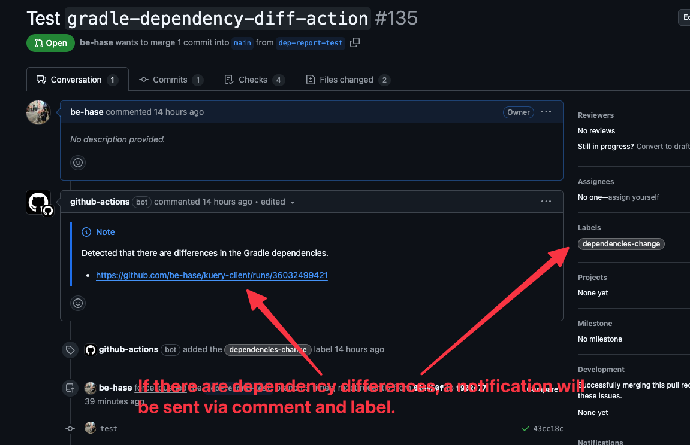
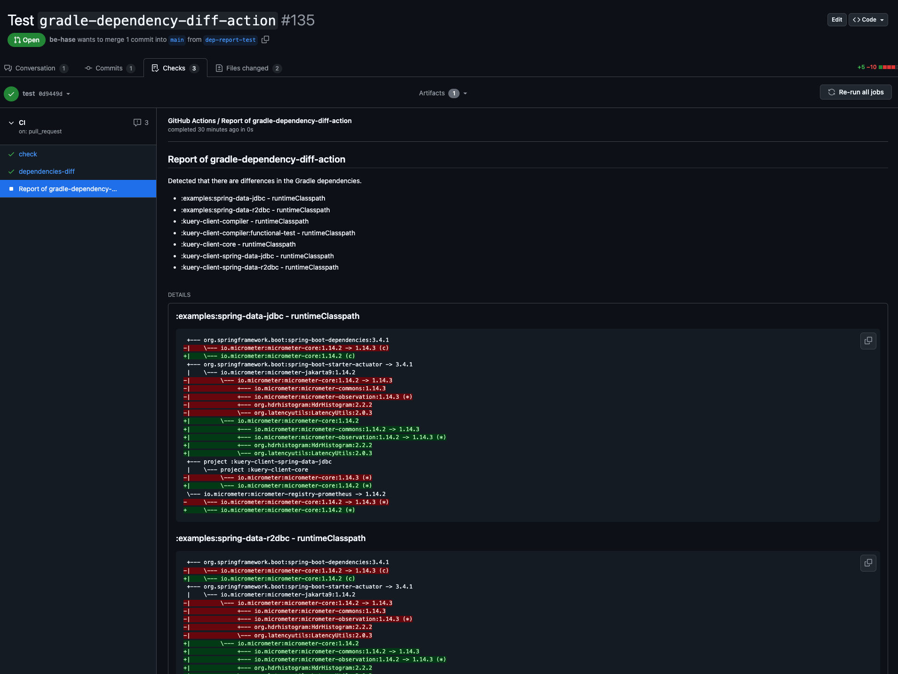
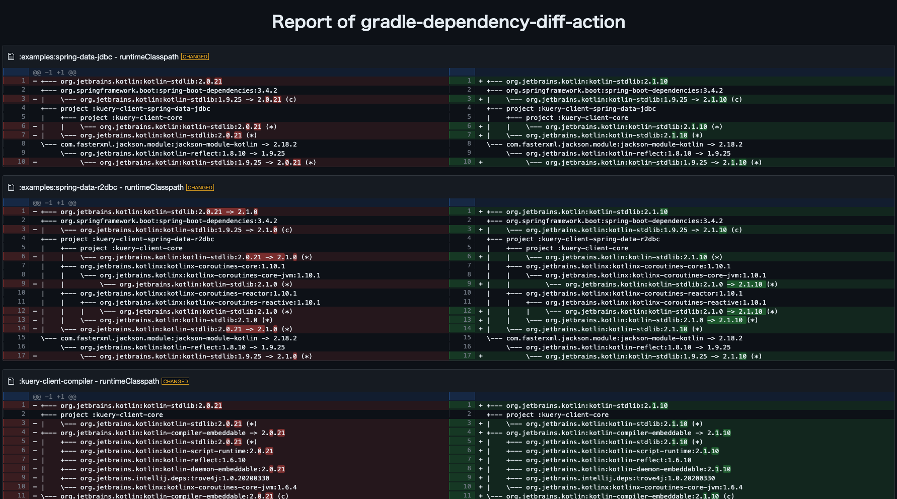

# gradle-dependency-diff-action

[](https://github.com/super-linter/super-linter)

[](https://github.com/actions/typescript-action/actions/workflows/check-dist.yml)
[](https://github.com/actions/typescript-action/actions/workflows/codeql-analysis.yml)
[](./badges/coverage.svg)

## What's this action?

- Executes
  [dependency-tree-diff](https://github.com/JakeWharton/dependency-tree-diff)
  for PRs and reports dependency differences.
- The dependency differences are reported as GitHub Checks.
  - Since GitHub Checks have a character limit of 65,535, multiple GitHub Checks
    will be created if there are many differences.
  - If the limit is exceeded for a single project, the output will be truncated.
    In such cases, the full differences can be viewed by downloading the actions
    artifact.
- When there are dependency differences, the following feedback is provided (can
  be disabled via settings):
  - Posts the GitHub Checks URL as a PR comment.
  - Adds a PR label.
  - Uploads the dependency differences as a text file to the actions artifact.
- Supports Gradle multi-project setups.

## Getting Start

### Requirements

- v2 (and later) runs on the Node 24 runtime, which requires
  [GitHub Actions Runner v2.327.1 or later](https://github.com/actions/runner/releases/tag/v2.327.1).
  GitHub-hosted runners already satisfy this. If you use self-hosted runners or
  GitHub Enterprise Server, make sure your runner is up to date before
  upgrading, since the floating `v2` tag picks up new releases automatically.
- For environments that cannot use a recent runner (e.g. older GitHub Enterprise
  Server), keep using `v1`.

### Apply `project-report` plugin

Please apply the project-report plugin to the project where you want to obtain
the dependency differences.

```kotlin
plugins {
    //...
    `project-report` // HERE !
}
```

### Write a workflow

Start by writing a workflow like the one below. It’s very easy to get started.

```yaml
name: CI
on:
  pull_request:

jobs:
  dependencies-diff:
    runs-on: ubuntu-latest
    steps:
      - uses: actions/checkout@v4
      - uses: actions/setup-java@v4
        with:
          distribution: temurin
          java-version: 17
      - uses: be-hase/gradle-dependency-diff-action@v2
```

## Report Samples

The appearance of the PR:



The appearance of the Checks:



The HTML report generated in the actions artifact:



## Configuration

| Name              | Description                                                                              | Default Value       |
| ----------------- | ---------------------------------------------------------------------------------------- | ------------------- |
| `tool-version`    | Version of [dependency-tree-diff](https://github.com/JakeWharton/dependency-tree-diff)   | 1.2.1               |
| `configurations`  | Target dependency configurations. Multiple values can be specified, separated by commas. | runtimeClasspath    |
| `post-pr-comment` | If true, posts a PR comment when there are dependency differences.                       | true                |
| `update-pr-body`  | If true, updates the PR body when there are dependency differences.                      | false               |
| `assign-label`    | If true, adds a PR label when there are dependency differences.                          | true                |
| `label-name`      | Label name used with assign-label.                                                       | dependencies-change |
| `upload-artifact` | If true, uploads the dependency differences as a text file to the actions artifact.      | true                |
| `token`           | Token used by this action.                                                               | ${{ github.token }} |

## FAQ

<details>
<summary>Error: Task 'dependencyReport' not found in root project</summary>

The project-report plugin may not be applied to the base branch of the Pull
Request.

</details>

## Contribute

```shell
# Install the dependencies
npm install

# Run the tests
npm test

# Package the TypeScript for distribution
npm run bundle

# ...etc. See package.json
```

This [template](https://github.com/actions/typescript-action) is used as a
reference.
